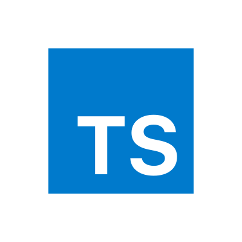

  
  <h1 align="center">TypeScript Fundamentals for the Riwi's training program</h1>

Welcome to our TypeScript Fundamentals Repository! 🚀 Designed as a
comprehensive training resource for Riwi coders, this repository is your gateway
to mastering TypeScript, a powerful superset of JavaScript. Dive into a
structured journey that covers everything from the basics of TypeScript syntax
to advanced concepts like type inference, generics, and module systems.

Each section is meticulously crafted to provide hands-on learning experiences,
with clear explanations, code examples, and exercises to reinforce your
understanding. Whether you're new to programming or transitioning from another
language, our repository offers a supportive environment to build a solid
foundation in TypeScript.

Join our community of junior developers on this exciting learning adventure, as
we explore the intricacies of TypeScript together and unlock its full potential
for building robust and scalable applications. Let's code, learn, and grow
together! 💻🌱 #TypeScriptFundamentals #LearningJourney

# Table of Contents

1. [Introduction to TypeScript](#1-introduction-to-typescript-30-minutes)
2. [TypeScript Basics](#2-typescript-basics-30-minutes)
3. [Advanced TypeScript Features](#3-advanced-typescript-features-30-minutes)
4. [Working with Modules](#4-working-with-modules-15-minutes)
5. [Handling Complex Data Functions](#5-handling-complex-data-functions-60-minutes)
6. [Advanced Data Handling](#6-advanced-data-handling-30-minutes)
7. [Testing and Debugging TypeScript Code](#7-testing-and-debugging-typescript-code-15-minutes)
8. [Deploying TypeScript Applications](#8-deploying-typescript-applications-15-minutes)
9. [Best Practices and Tips](#9-best-practices-and-tips-15-minutes)

* Follow this [link](material/topics_Guide.md) for details

## Resources

- [TypeScript Documentation](https://www.typescriptlang.org/docs/)
- [TypeScript Playground](https://www.typescriptlang.org/play)
- [TypeScript GitHub Repository](https://github.com/microsoft/TypeScript)
- [TypeScript Handbook](https://www.typescriptlang.org/docs/handbook/intro.html)
- [TypeScript cheatsheet](https://www.typescriptlang.org/cheatsheets)

## Utilities

- [ts-node](https://github.com/TypeStrong/ts-node): TypeScript execution and
  REPL for node.js
- [tslint](https://palantir.github.io/tslint/): An extensible linter for the
  TypeScript language.
- [Prettier](https://prettier.io/): An opinionated code formatter.
